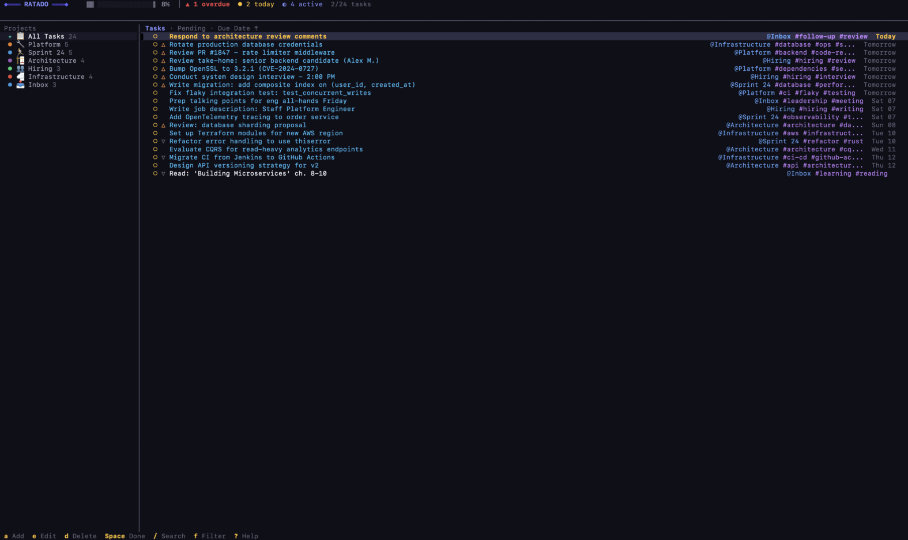
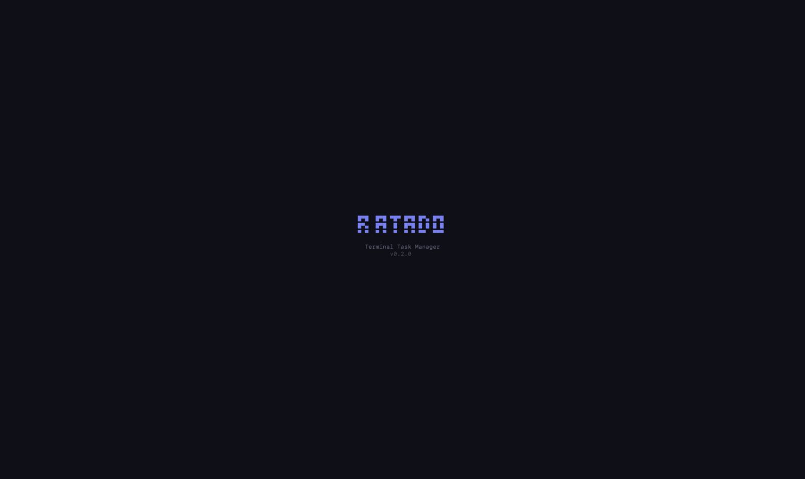
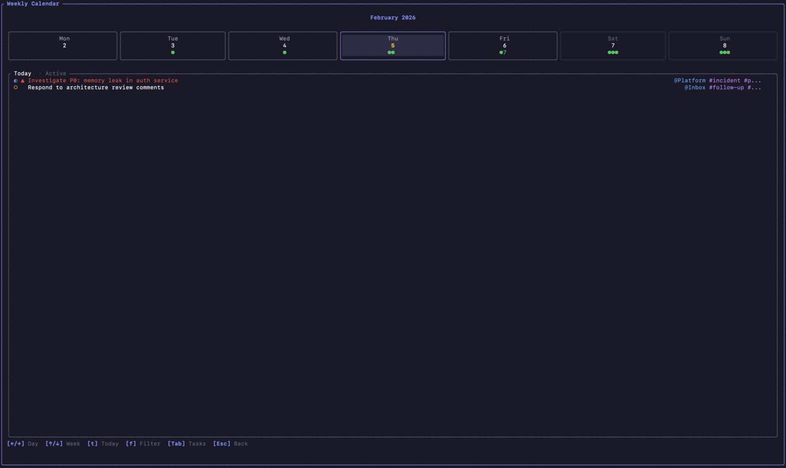

# Ratado

A fast, keyboard-driven terminal task manager built with Rust and [Ratatui](https://ratatui.rs/).




## Features

- **Fast & Lightweight** - Instant startup, minimal resource usage
- **Keyboard-Driven** - Full functionality accessible without a mouse
- **Vim-Style Navigation** - Familiar keybindings for terminal users
- **Offline-First** - All data stored locally in SQLite
- **Quick Capture** - Rapid single-line task entry with `@project #tag !priority due:date` syntax
- **Projects & Tags** - Organize tasks with projects and flexible tagging
- **Smart Filtering** - Filter by status, priority, due date, project, or tag
- **Weekly Calendar** - Visual overview of tasks by due date
- **Full-Text Search** - Search across task titles and descriptions

## Installation

### Pre-built Binaries (Recommended)

Download the latest release for your platform from [GitHub Releases](https://github.com/milosmiric/ratado/releases).

| Platform | File |
|----------|------|
| macOS (Apple Silicon) | `ratado-aarch64-apple-darwin.tar.gz` |
| macOS (Intel) | `ratado-x86_64-apple-darwin.tar.gz` |
| Linux | `ratado-x86_64-unknown-linux-gnu.tar.gz` |
| Windows | `ratado-x86_64-pc-windows-msvc.zip` |

```bash
# macOS/Linux: Extract and move to PATH
tar xzf ratado-*.tar.gz
sudo mv ratado /usr/local/bin/
```

### Homebrew (macOS/Linux)

```bash
brew tap milosmiric/tap
brew install ratado
```

### From Source

Requires Rust 1.85 or later.

```bash
# Clone the repository
git clone https://github.com/milosmiric/ratado.git
cd ratado

# Build and install
cargo build --release

# Run
./target/release/ratado
```

### Requirements

- A terminal with Unicode support

## Usage

Launch Ratado:

```bash
ratado

# Use a custom database path
ratado --db-path ~/my-tasks.db
```

Data is stored at `~/Library/Application Support/ratado/ratado.db` (macOS) or `~/.config/ratado/ratado.db` (Linux)

## Keybindings

### Navigation

| Key | Action |
|-----|--------|
| `j` / `↓` | Move down |
| `k` / `↑` | Move up |
| `g` / `Home` | Jump to top |
| `G` / `End` | Jump to bottom |
| `Ctrl+d` | Page down |
| `Ctrl+u` | Page up |
| `Tab` | Switch panel |
| `h` / `←` | Focus sidebar |
| `l` / `→` | Focus task list |

### Tasks

| Key | Action |
|-----|--------|
| `a` | Quick capture task |
| `A` | Add task (full form) |
| `e` / `Enter` | Edit selected task |
| `d` | Delete task |
| `Space` | Toggle completion |
| `p` | Cycle priority |
| `t` | Edit tags |
| `m` | Move to project |

### Projects (Sidebar Focused)

| Key | Action |
|-----|--------|
| `a` | Add new project |
| `e` / `Enter` | Edit project |
| `d` | Delete project |
| `Tab` | Switch between Projects/Tags |

### Filters & Views

| Key | Action |
|-----|--------|
| `f` | Open filter/sort dialog |
| `T` | Filter: Due today |
| `W` | Filter: Due this week |
| `1-4` | Filter by priority |
| `/` | Search tasks |
| `c` | Calendar view |
| `S` | Settings |

### General

| Key | Action |
|-----|--------|
| `?` | Show help |
| `r` | Refresh data |
| `F12` | Debug logs |
| `q` | Quit |
| `Ctrl+c` | Force quit |

## Screenshots

### Splash Screen



### Task List


### Calendar View



## Quick Capture

Press `a` to open the Quick Capture spotlight. Type a single line with inline tokens to rapidly create tasks:

```
Fix auth bug @Platform #p0 !1 due:tomorrow
```

| Token | Meaning | Example |
|-------|---------|---------|
| `@Name` | Assign project (fuzzy matched) | `@Work` |
| `#tag` | Add tag | `#urgent` |
| `!1`–`!4` | Set priority (1=urgent, 4=low) | `!1` |
| `due:val` | Set due date | `due:tomorrow` |

Autocomplete suggestions appear for projects, tags, and priorities. Press `Tab` to accept a suggestion, or expand to the full task form when no suggestions are showing.

## Task Attributes

| Attribute | Description |
|-----------|-------------|
| Title | Task name (required) |
| Description | Detailed notes with link support |
| Due Date | When task is due |
| Priority | Low, Medium, High, Urgent |
| Status | Pending, In Progress, Completed, Archived |
| Project | Group tasks under projects |
| Tags | Flexible categorization labels |

## Filtering Options

- **Status**: All, Pending, In Progress, Completed, Archived
- **Date**: Due Today, Due This Week, Overdue
- **Priority**: Urgent, High, Medium, Low
- **Organization**: By Project, By Tag

## Sorting Options

- Due Date (ascending/descending)
- Priority (highest/lowest first)
- Creation Date (newest/oldest)
- Alphabetical

## Architecture

```
src/
├── main.rs              # Entry point
├── app.rs               # Application state
├── ui/                  # Ratatui widgets and views
├── models/              # Task, Project, Filter structs
├── handlers/            # Keyboard input and commands
├── storage/             # SQLite database operations
└── utils/               # Date/time helpers
```

## Development

```bash
# Run in development
cargo run

# Run tests
cargo test

# Run linter
cargo clippy

# Format code
cargo fmt

# Generate documentation
cargo doc --open
```

## License

This project is licensed under the MIT License - see the [LICENSE](LICENSE) file for details.

## Author

**Miloš Mirić**

- GitHub: [@milosmiric](https://github.com/milosmiric)
- LinkedIn: [milosmiric](https://www.linkedin.com/in/milosmiric/)

## Acknowledgments

- [Ratatui](https://ratatui.rs/) - Terminal UI framework
- [Turso](https://turso.tech/) - SQLite-compatible database
- [Crossterm](https://github.com/crossterm-rs/crossterm) - Terminal manipulation
